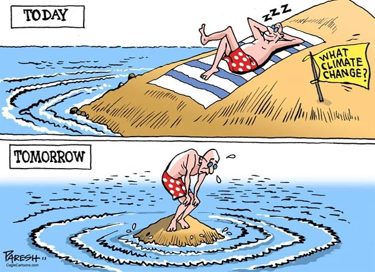
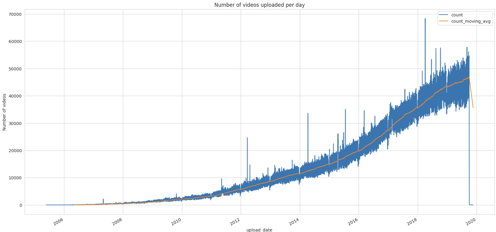
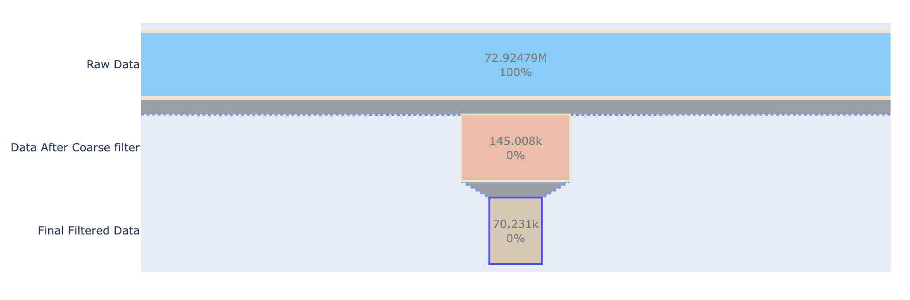
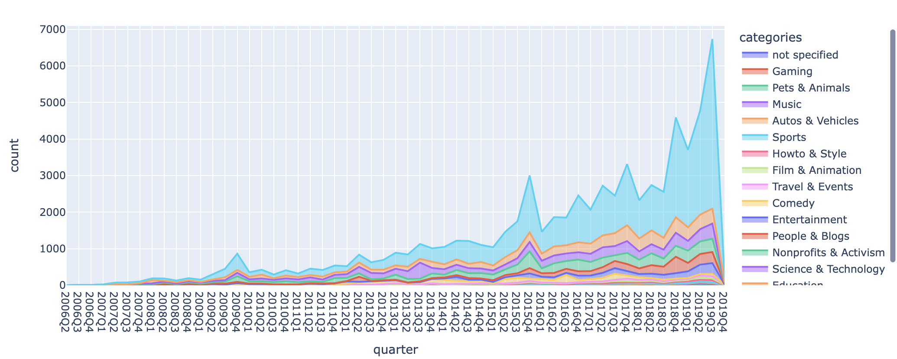
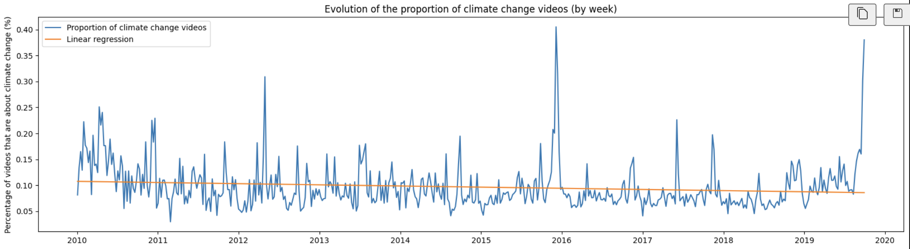
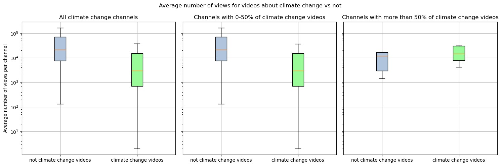

  
YouTube has evolved beyond its origins as a mere video-sharing platform and has now emerged as a pivotal social media channel, revolutionizing how we engage with information, entertainment, and societal issues. In this digital era, YouTube's impact extends far beyond cat videos and entertainment content; it has become a significant space for raising awareness about crucial global topics. With billions of users worldwide, YouTube serves as a democratic platform where creators, educators, activists, scientists, and policymakers share diverse content on hot issues. Talking about hot issues this datastory will study one particularly hot issue: climate change. It will try to answer these questions: did climate change become a topic more important on YouTube as it has become in our society? Can we relate spikes in the interest in climate change on YouTube with real world events?

  
## About YouNiverse

  
YouNiverse is a large dataset collection of channel and video metadata from English-language YouTube. The metadata covers over 136k channels and 72.9M videos providing information about the videos realated to their categories, upload date, description ,and interactions statistics. The time frame considered is between May 2005 and October 2019. In addition, YouNiverse provides a time series dataset focusing on channels and the evolution of their views, subscribers, and number of videos over time from early January to the end of September. 

  
In this graph, we observe the evolution of the number of videos uploaded per day on YouTube. The quantity of uploaded videos has significantly increased since 2012, indicating a surge in demand. However, another topic that has seen considerable development during this period is climate change. Climate change has become an interesting issue for people, as they desire to stay updated on global climate events and are also eager to learn more. What consequences might this trend have on the proportion of videos uploaded about climate change?

## About Climate change on Youtube

  
Here, using these two interactive plots, you can observe the proportion of YouTube videos discussing climate change. These plots depict only a fraction of the total videos available on the platform. Yet, this is expected considering that climate change is a relatively recent issue, and YouTube hosts a wide array of content spanning various categories such as music, gaming, and sports. However what is  crucial to examine is the evolution of Climate change videos over time.

As we can see there is an increase of videos on climate change overtime. But is this due to the recent spread of popularity of youtube or is this due to an increase of interest for climate change topics? To answer this question it is necessary to focus on the evolution of the proportion of videos focussing on cliamte change over time.

This plot illustrating the evolution of the proportion of climate change videos by week shows a consistent decrease in the number of videos dedicated to discussing climate change. However, interpreting this decline as an indicator of lack of interest in climate change might be premature. Alternatively, it raises the question of whether videos centered on climate change are becoming less appealing compared to other content. Could this declining trend be attributed to the rapid surge in popularity of other genres on YouTube? For instance, the platform is notably dominated by certain categories such as gaming, which continually experiences rapid growth. It's plausible that this surge in gaming content isn't aligned with climate change discussions, possibly resulting in fewer videos addressing this critical topic. Hence, conducting an in-depth analysis categorized by content type seems imperative to comprehend the dynamics influencing viewership patterns and preferences on the platform.

## Overall audience response: how are climate videos perceived ? A study by category (PAUL)

  
Faire l'analyse par catégorie et dire que en fonction de la catégorie ce n'est pas pareil, parler de news and politics --> majorité des vidéos de climate sont de cette catégorie et les conséquences qui en découle!

Transition: 
So overall what makes a video popular or not?

## Popular analysis (NASTASIA)

  
Première partie de l'analyse de Nastasia:

Are popular videos on climate change from popular channels or are they relevant to a specific event that made them famous. This is what we are going to see in this part. Are there some channels that are specilaized on climate change and if yes what are the consequences?

Are specilaized climate change channel more popular than regular channels, will their climatechnage videos have more success?

  
So, we have observed that depending on your channel type, if you are an active YouTuber discussing climate change, your videos will receive more or fewer views. Climate chnage is therefore a niche sector on Youtube, for a targeted audience that is fond of videos about climate change."But are there other parameters that make a climate change video more attractive than others, or vice versa?

## Sentiment analysis (SEB)

  
Emotions run high when discussing the alarming issue of climate change. The current situation paints a bleak picture, and as time passes, the daunting reality of averting the catastrophic consequences becomes increasingly apparent. However, amidst this turmoil, a glimmer of hope emerges. There are those who find solace in witnessing the growing number of individuals taking action and the emergence of groundbreaking technologies. Therefore we ask ourself: does the presentation style of climate change videos influence their impact? Are viewers drawn to these videos seeking to shed tears over the impending crisis, or are they yearning to nurture their optimism for a brighter future? The way climate change issues are portrayed might wield immense power in shaping viewers' emotions and perceptions, possibly influencing their actions and hopes for the world that lies ahead.



## A Deeper analysis, can we relate view peaks to current events? (AGATHA)

  
While climate change may not captivate every YouTube user, certain events have the power to alter this disinterest. Significant occurrences have the ability to shift our perspective on the world, compelling us to react. There's a natural inclination among individuals to respond, to voice their thoughts and opinions on the subject when such events occur. Is it possible to identify which events have had the greatest impact on people and incited their reactions regarding climate change?

### Number of videos uploaded

  
A first approach consits of analysing the number of videos uploaded to find some peaks and match them with current events.

### Tags analysis (SEB)

  
A second approach consists of analysing the number of tags to find some peaks and match them with current events.
By looking at the most popular tags related to climate change, we observe regualr count sikes which can some time be related to current events. For example, the tag "cop21" is the most popular tag in 2015, which is the year of the Paris Agreement. This agreement was signed by 196 countries to reduce greenhouse gas emissions and limit the global temperature increase to 1.5°C. This event was a major step in the fight against climate change, and it is not surprising that it has generated a lot of interest on YouTube.



We will now focus on the period around the COP21 to see what other information can we extract from Youtube about this event. 

## Conclusion