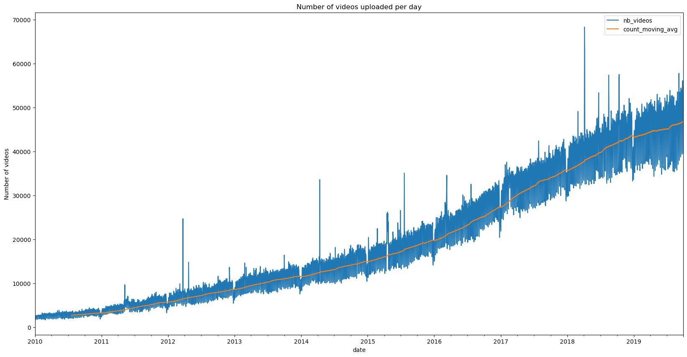
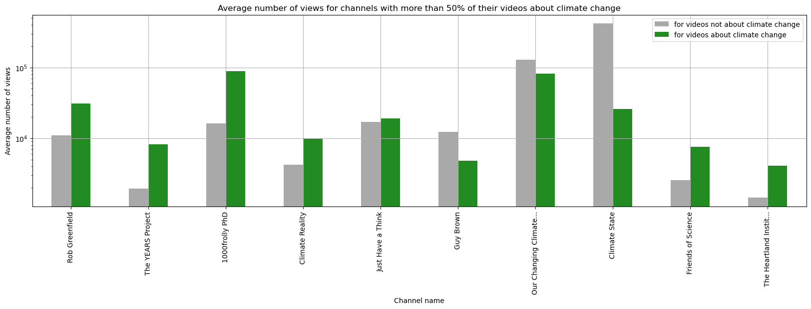

  
YouTube has evolved beyond its origins as a mere video-sharing platform and has now emerged as a pivotal social media channel, revolutionizing how we engage with information, entertainment, and societal issues. In this digital era, YouTube's impact extends far beyond cat videos and entertainment content; it has become a significant space for raising awareness about crucial global topics. With billions of users worldwide, YouTube serves as a democratic platform where creators, educators, activists, scientists, and policymakers share diverse content on hot issues. Talking about hot issues this datastory will study one particularly hot issue: climate change. It will try to answer these questions: did climate change become a topic more important on YouTube as it has become in our society? Can we relate spikes in the interest in climate change on YouTube with real world events?

  
## About YouNiverse

  
YouNiverse is a large dataset collection of channel and video metadata from English-language YouTube. The metadata covers over 136k channels and 72.9M videos providing information about the videos realated to their categories, upload date, description, and interactions statistics. The time frame considered is between May 2005 and October 2019. In addition, YouNiverse provides a time series dataset focusing on channels and the evolution of their views, subscribers, and number of videos over time from early January to the end of September. 

  
In this graph, we observe the evolution of the number of videos uploaded per day on YouTube. The quantity of uploaded videos has significantly increased since 2012, indicating a surge in demand. However, another topic that has seen considerable development during this period is climate change. Climate change has become an interesting issue for people, as they desire to stay updated on global climate events and are also eager to learn more. What consequences might this trend have on the proportion of videos uploaded about climate change?

## About Climate change on Youtube

  
Here, using this interactive plot, you can observe the proportion of YouTube videos discussing climate change. This plot depicts only a fraction of the total videos available on the platform. Yet, this is expected considering that climate change is a relatively recent issue, and YouTube hosts a wide array of content spanning various categories such as music, gaming, and sports. However what is crucial to examine is the evolution of climate change videos over time.



As we can see there is an increase of videos on climate change overtime. But is this due to the recent spread of popularity of youtube or is this due to an increase of interest for climate change topics? To answer this question it is necessary to focus on the evolution of the proportion of videos focussing on cliamte change over time.

This plot illustrates the evolution of the proportion of climate change videos by week. It shows a consistent decrease in the number of videos dedicated to discussing climate change. However, interpreting this decline as an indicator of lack of interest in climate change might be premature. Alternatively, it raises the question of whether videos centered on climate change are becoming less appealing compared to other content. Could this declining trend be attributed to the rapid surge in popularity of other genres on YouTube? For instance, the platform is notably dominated by certain categories such as gaming, which continually experiences rapid growth. It's plausible that this surge in gaming content isn't aligned with climate change discussions, possibly resulting in fewer videos addressing this critical topic. Hence, conducting an in-depth analysis categorized by content type seems imperative to comprehend the dynamics influencing viewership patterns and preferences on the platform.

Before conducting this study, let's analyze the trend in the average number of views of climate change videos compared to all videos over time. Previously, we examined the number of videos uploaded, which illuminated the interest of YouTubers. However, assessing the popularity of a video for the audience is more accurate by examining the number of views.

Two conclusion can be said from this study.Firstly when focussing across all video categories, there exists a tendency for older videos to accumulate a higher total view count. This could be explained by their extended duration on the platform. However, a notable distinction emerges in the realm of climate change videos. Here, a more consistent pattern is observed, suggesting that older climate change-related content tends to attract fewer views over time, hinting at a potential perception of rapid obsolescence. We also observe some peaks at certain times. This peaks are rapid and steady letting thing that an important event happened. It's worth noting that we intend to delve deeper into interpreting the abrupt spikes in view counts as part of our subsequent analysis.

## Analysis climate change videos' categories 

What are climate change related videos main youtube categories and how does it compare to overall youtube? Was there an evolution of these categories ?



As previously mentioned, let's narrow our focus to specific key categories. As expected, the primary categories for climate-related videos significantly differ from the broader spectrum on YouTube. Categories such as Gaming and Music, prevalent across YouTube, are notably scarce in climate change-related content. Conversely, certain categories have gained prominence in climate change-related videos: News & Politics, Education, Science & Technology, and Non-Profit & Activism. These four categories collectively constitute 80% of climate change-related videos, with News & Politics alone accounting for 50%. This suggests that on YouTube, climate change appears to be more of a political or news-focused topic rather than a subject pertaining to science or education. This prompts the question: has this trend always been the case?
Based on this categorical analysis, we've selected specific relevant categories—Education, News & Politics, Non-Profits & Activism, and Science & Technology—due to their abundance of climate change-related videos and their relevance.

Several intriguing spikes suggest that specific videos have significantly influenced their respective categories. Moreover, some spikes transcend categories, indicating that certain events had a widespread global impact.



We can see that Climate Change was always mainly in News & Politics categorie but this tends to drastically increase as it increase on overall YouTube, but in greater proportions. We can also draw these interesting fact:
* Climate Change was much more of a Non Profit & Activism topic in 2010 than in 2019 (20% versus 7% of uploaded videos)
* Climate Change was much more of a Science & Technology topic in 2013 than in 2019 (38% versus 7% of uploaded videos)
* There was up to 10% of Climate change related videos in Comedy but nearly 0 in 2019, we do not joke about climate change anymore.

## Popular analysis

  
Are climate change videos more popular than other videos? This is what we are going to see in this part. 

   
Here are all the channels that contains climate videos. The darker the dot, the more pourcentage of climate videos thay contain and the bigger they are, the more videos they uploaded on the topic.



  
We notice that most of the channels with a high proportion of climate change videos are under the x=y curve. This would mean channels with a high ratio of climate videos tend to do good compared to their other videos. We will analyse more in details how good climate videos do in general:

 
This box plot shows that in average, videos on climate change are not very popular on YouTube, especially if the channel is not specialized in the topic. Making climate change videos will not make you famous. However, if your channel has a high ratio of climate videos, then you might have an audience that is interested in the topic and continuing to make those videos will make you gain views.   
Therefore, we have observed that depending on your channel type, if you are an active YouTuber discussing climate change, your videos will receive more or fewer views. Climate chnage is therefore a niche sector on Youtube, for a targeted audience that is fond of videos about climate change.But how are these videos received by the audience?

## Analysis of the channels that are strongly involved with the climate change topic

Are there some channels that are specilaized on climate change and if yes what are the consequences? Are their views related to international climate events?

  
Here are all the channels that have more than 50% of their content corresponding to climate change videos. They are precisely 10.

  
We will now consider their number of views per day and observe if they are correlated to climate change event:


 
After some further investigations, it seems that even if some pics look like they could be related, the videos uploaded in that period of time do not have any correlation with the event in question.  
Most of the videos of the channels that are involved with climate change usually do not make videos about specific events and when they do, it is months after the event and they usually don't have many views. Therefore, that explains why we don't observe more pronounced pics of views on those channels after a climate event.

## Sentiment analysis 

  
Emotions run high when discussing the alarming issue of climate change. The current situation paints a bleak picture, and as time passes, the daunting reality of averting the catastrophic consequences becomes increasingly apparent. However, amidst this turmoil, a glimmer of hope emerges. There are those who find solace in witnessing the growing number of individuals taking action and the emergence of groundbreaking technologies. Therefore we ask ourself: does the presentation style of climate change videos influence their impact? Are viewers drawn to these videos seeking to shed tears over the impending crisis, or are they yearning to nurture their optimism for a brighter future? The way climate change issues are portrayed might wield immense power in shaping viewers' emotions and perceptions, possibly influencing their actions and hopes for the world that lies ahead.

  
We can see that the category of the video has an impact on the sentiment of the video. Indeed, videos in the category "Education" are more optimistic than videos in the category "News & Politics". This is not surprising since videos in the category "Education" are more likely to focus on solutions to climate change, while videos in the category "News & Politics" are more likely to focus on the negative consequences of climate change.

  
We all see that negative videos are more popular than positive videos. This is not surprising since negative videos are more likely to be shared on social networks. Indeed, people are more likely to share a video that makes them angry than a video that makes them happy. This is called the "anger effect" and it has been observed in several studies.



## A Deeper analysis, can we relate view peaks to current events? 

  
While climate change may not captivate every YouTube user, certain events have the power to alter this disinterest. Significant occurrences have the ability to shift our perspective on the world, compelling us to react. There's a natural inclination among individuals to respond, to voice their thoughts and opinions on the subject when such events occur. Is it possible to identify which events have had the greatest impact on people and incited their reactions regarding climate change?

### Number of videos uploaded

  
A first approach consists of analysing the number of videos uploaded to find some peaks and match them with current events.

This plot shows the relation between current event and the number of video uploaded pointing out how current event have an impact on youtube.

### Tags analysis 

  
A second approach consists of analysing the number of tags to find some peaks and match them with current events.
By looking at the most popular tags related to climate change, we observe regualr count sikes which can some time be related to current events. For example, the tag "cop21" is the most popular tag in 2015, which is the year of the Paris Agreement. This agreement was signed by 196 countries to reduce greenhouse gas emissions and limit the global temperature increase to 1.5°C. This event was a major step in the fight against climate change, and it is not surprising that it has generated a lot of interest on YouTube.



  
We will now focus on the period around the COP21 to see what other information can we extract from Youtube about this event.

We first construct a bipartite graph between the tags and the videos. We then project this graph on the tags to obtain a graph of tags where two tags are connected if they appear in the same video, the width of the edge being proportional to the number of videos in which the two tags appear together.

We then select the community that contains the tag "cop21".

  

We see that the tags related to COP21 cover multiple climate change subjects.

## Conclusion

In conclusion, we can say that climate change is a topic that is becoming more and more important on YouTube. However, it is still a niche topic, and it is not yet as popular as other topics such as gaming or music. 
We have also seen that the way climate change is presented in videos can have a significant impact on the number of views. Indeed, videos that are more optimistic and that focus on solutions to climate change are more popular than videos that are alarmist and that focus on the negative consequences of climate change. 
Finally, we have seen that some events have a significant impact on the number of videos uploaded and the number of views. This is particularly the case for the COP21, which generated a lot of interest on YouTube. We can therefore conclude that YouTube is a good indicator of the interest of the general public in climate change.